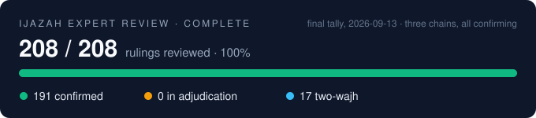

# The review ladder

Three independent chains of transmission have examined every ruling in the
register, with no contact between them.
This is the full record: who reviewed what, how their independence was
measured, and what each found. The adjudications themselves are in
[ADJUDICATIONS.md](ADJUDICATIONS.md).

The engine is feature-complete and green (564 tests): the core rule
pipeline, mid-ayah waqf and resume segmentation with the full waqf farsh,
tagged waqf-variant enumeration (rawm/ishmam and the transmitted site
wajhs), the wasl concat phase across ayah and surah boundaries, the token
layer, and the warm-start bijection. In progress downstream: the
alignment-based realized-length pipeline (with a blind fixed-madd
recovery gate before any corpus relabeling) and the ASR integration.

A human expert review pass over the golden set and the rulings register is
the final release gate. The machine validation in the README is necessary, not
sufficient, and the maintainer holds the tradition's own standard, التلقي,
above any engine, including this one.

**That review is now complete (Rabi' al-Awwal 1448 / August 2026).**
Each of the 208 entries in the rulings register was independently ruled
on (صحيح / خطأ / فيه وجهان, with correction and reason required for any
خطأ). The outcome: **191 entries confirmed, 17 marked فيه وجهان
(agreements in substance that document a second transmitted wajh), and
zero rulings judged wrong.** The review's scrutiny did surface four
defects in row *labels*; each was adjudicated against the cited
classical texts on the public record (`docs/ADJUDICATIONS.md`), each
proved a labeling slip rather than an engine error, and each is now
guarded by a permanent automated gate. The reviewer's credentials are
documented with the maintainer, scans on file:

- **hafiz of the entire Quran**, board-examined by Wifaq al-Madaris
  al-Salafiyyah (Pakistan), grade mumtaz, 1443/2022
- holder of a **written ijazah in Hafs 'an 'Asim via tariq
  al-Shatibiyyah** (1434/2013) whose text carries the authorization to
  transmit (وقد أجزته أن يقرئ غيره كما قرأ) and a connected sanad
  (الإسناد المتصل) to the Prophet ﷺ
- full-Quran **tajweed certificate** (mumtaz, 377/400) on the classical
  curriculum: al-Muqaddimah al-Jazariyyah, Tuhfat al-Atfal, Jamal
  al-Qur'an, Fawa'id Makkiyyah, Taysir al-Tajweed
- certified by the **Prophet's Mosque Qur'an program** in Madinah
  (10 ajza', 96.94%); currently a Shari'ah student at the Islamic
  University of Madinah

Before engagement the reviewer passed a blind screening: ten rulings,
three of which carried deliberately planted errors: all three caught,
zero false alarms on the seven true rulings. The same screening has
since failed other candidate reviewers; a filter that everyone passes
proves nothing, so the fails are part of what the passes mean. Verdicts
were given from his own knowledge, independently of the engine and its
sources; every disagreement was adjudicated against the cited classical
texts on the public record (`docs/ADJUDICATIONS.md`), and the golden
rows' `expert_reviewed` flags flip only on confirmed verdicts.
The reviewer is credited, at his own preference, as **Shaikh Sami
Almadani**.

**Above the review sits a third, stricter layer, and it too is now
complete.** Formal scholarly arbitration (تحكيم علمي) of the complete
register was carried out by a serving **professor at the Department of
Qira'at, Umm al-Qura University in Makkah**, engaged through a formal
invitation stating scope, independence protocol, and honorarium, with
no contact between him and the first reviewer. He ruled on every entry
from his own learning, in his own words «وفق ما تلقيته وقرأته على
أساتذتي ومشايخي» (according to what I received and read before my
teachers and shaykhs), and delivered his verdicts with 46 written
notes. His objections were adjudicated against the cited classical
texts on the same public record (`docs/ADJUDICATIONS.md`, entries 5
and 6): one label corrected at his direction, with no engine change,
and one row upheld with the reasoning documented. At his own request
he is credited here by academic title only, without his name.

**A second arbitration, fully independent of the first, is also now
complete.** Another serving **professor of Qira'at at Umm al-Qura
University** examined every row of the full register, engaged
separately and blind to both prior reviewers and their verdicts. His
independence was measured the same way the first reviewer's was: the
deliberately planted errors embedded in his instrument, dressed in
the register's own citation format, were all caught and refuted with
the classical sources cited back at us. He returned written notes on
some forty rows, and not one overturned a phonetic ruling of the
engine: they refine wordings, document khilaf where the books
themselves carry two positions, and correct typography, and every one
has been folded into the register in his own words (`tests/goldens/`).
He is credited by rank alone.

The ladder held as designed: machine validation proves the engine
implements the register; the ijazah-holder's row-by-row review proves
the rulings match the transmitted riwaya; the professors' arbitrations
seal the register at the tradition's highest academic rank. **Three
independent chains of transmission, with no contact between them, have
now each confirmed the register in full.** Disagreements at every layer resolved the same way:
against the cited classical texts, on the public record.

Final tally:

  

